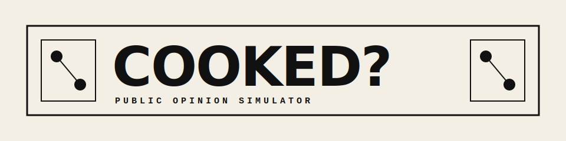

# COOKED?

<p align="center">
  
</p>

<p align="center">
  
  
  
  
  
</p>

COOKED? is a local-first virtual market testing lab for early product ideas, startup pitches, campaigns, and positioning experiments. Upload a PDF, Markdown file, or plain text idea, then let the system turn it into a simulated public conversation with AI agents, graph memory, social dynamics, and a final market-readiness report.

The short version: COOKED? helps you learn whether an idea is compelling before you spend real money building, launching, or pitching it.

This repository is a modified version of [666ghj/MiroFish](https://github.com/666ghj/MiroFish). The original project is licensed under the GNU Affero General Public License v3.0, and this modified version keeps that license. See [LICENSE](LICENSE) and [NOTICE](NOTICE).

## What COOKED? Does

COOKED? simulates how a product idea might be received by different groups of people. It is not just a chatbot that says whether an idea is good. The app builds a miniature market environment, generates agent personas, runs conversations across social-style platforms, and turns the result into a report.

The workflow looks like this:

```text
Upload idea or document
        |
        v
Extract entities, claims, value props, risks, and target users
        |
        v
Build a graph-backed project memory
        |
        v
Generate simulated public roles and stakeholder agents
        |
        v
Run a dual-platform discussion
        |
        v
Score purchase intent, objections, risks, and next moves
        |
        v
Produce a report you can use for iteration
```

## Why It Exists

Most early-stage validation is slow, expensive, or too polite to be useful.

Focus groups can be expensive. Surveys often flatten nuance. A normal LLM chat can give a neat answer, but it usually does not create disagreement, social pressure, second-order reactions, or changing opinions over time.

COOKED? is built for the messy middle:

- Will people understand the idea?
- Who gets excited first?
- Who attacks it?
- What are the strongest objections?
- Does the pitch survive social discussion?
- Which features sound valuable, and which sound fake?
- Is the idea undercooked, overhyped, niche, or actually promising?

It is meant to be a fast pre-flight simulator for product judgment. It does not replace real users, but it can help you reach real users with sharper questions.

## Core Features

### Document-Based Idea Intake

Upload an idea as PDF, Markdown, or text. COOKED? parses the content and extracts the market context it needs for simulation.

Useful inputs include:

- Startup one-pagers
- Product requirement drafts
- Landing page copy
- Pitch decks exported as PDF
- Campaign concepts
- Feature specs
- Research notes
- Founder memos

### GraphRAG-Style Project Memory

COOKED? organizes your uploaded material into a graph-backed memory layer. Agents can refer back to the project context instead of responding from generic assumptions only.

This is useful when your idea has specific constraints, named competitors, stakeholders, pricing, user segments, or launch channels.

### Simulated Public Agents

The system generates diverse agents representing customers, critics, vendors, observers, and other market voices. They are designed to disagree, react, question, and influence each other.

That makes the output more useful than a single averaged response.

### Dual-Platform Social Simulation

COOKED? models two different social surfaces:

- A fast, short-form discussion environment
- A slower, thread-oriented community environment

The same idea can perform differently depending on the social context. A punchy consumer product might spread well in one environment and get torn apart in another.

### Purchase Intent and Risk Evaluation

The report layer summarizes signals such as:

- Purchase motivation
- Trust and credibility
- Price sensitivity
- Social proof
- Differentiation
- Adoption friction
- Competitive pressure
- Confusing claims
- Messaging gaps
- Critical objections

The goal is not to produce a magic score. The goal is to show why the score happened.

### History and Replay

The modified COOKED? build includes history-oriented UI work so previous runs can be reviewed. This is useful when comparing revisions of the same idea.

## Who It Is For

COOKED? is especially useful for:

- Solo founders testing an idea before building an MVP
- Indie hackers checking whether a landing page sounds believable
- Students preparing product or entrepreneurship projects
- Marketers stress-testing campaign angles
- Product managers comparing feature narratives
- Researchers exploring simulated public opinion workflows
- Builders who want a private local sandbox before exposing an idea

## What It Is Not

COOKED? is not a real market study. It does not replace:

- Real customer interviews
- Sales calls
- Paid acquisition tests
- Usability testing
- Legal, financial, or medical review
- Production-grade forecasting

Treat the output as a structured simulation, not as truth. The best use is to find hypotheses, objections, and blind spots faster.

## Tech Stack

| Layer | Technology |
|---|---|
| Frontend | Vue 3, Vite, D3 |
| Backend | Python, Flask |
| Memory and graph layer | Zep Cloud integration |
| LLM provider | OpenRouter-compatible API configuration |
| Simulation scripts | Python-based parallel social simulation |
| File parsing | PDF and text parsing utilities |
| Local launch | Windows batch scripts, manual Unix-style commands |

## Repository Structure

```text
COOKED/
├── backend/
│   ├── app/
│   │   ├── api/                  # Flask API routes
│   │   ├── models/               # Data models
│   │   ├── services/             # Graph, simulation, reports, LLM calls
│   │   └── utils/                # Logging, parsing, locale, retry helpers
│   ├── scripts/                  # Simulation runners
│   └── start-backend.bat         # Windows backend launcher
├── frontend/
│   ├── public/                   # Static browser assets
│   ├── src/
│   │   ├── api/                  # Frontend API clients
│   │   ├── assets/               # Logo and visual assets
│   │   ├── components/           # Vue components
│   │   ├── router/               # Vue Router setup
│   │   └── views/                # App screens
│   └── start-frontend.bat        # Windows frontend launcher
├── examples/                     # Demo startup ideas
├── locales/                      # UI language strings
├── static/                       # Static images
├── run.bat                       # Windows one-click launcher
├── stop.bat                      # Windows stopper
├── LICENSE                       # AGPL-3.0 license text
└── NOTICE                        # Upstream attribution and modification notice
```

## Requirements

Install these before running the app:

- Python 3.10 or newer
- Node.js 18 or newer
- npm
- An OpenRouter-compatible API key
- A Zep Cloud API key and tenant ID

The project is designed for local development. Keep credentials in `.env`; do not commit real keys.

## Quick Start on Windows

The easiest path is:

```bat
run.bat
```

The launcher starts:

- Backend API on `http://localhost:5001`
- Frontend app on `http://localhost:5173`

To stop the local services:

```bat
stop.bat
```

There are also separate launchers if you want to run each side manually:

```bat
backend\start-backend.bat
frontend\start-frontend.bat
```

## Manual Setup

### Backend

```bash
cd backend
python -m venv .venv

# Windows
.venv\Scripts\activate

# macOS or Linux
source .venv/bin/activate

pip install --ignore-requires-python flask flask-cors python-dotenv zep-cloud httpx pypdf camel-oasis
set FLASK_APP=app
flask run --port 5001
```

On macOS or Linux, use:

```bash
export FLASK_APP=app
flask run --port 5001
```

### Frontend

```bash
cd frontend
npm install
npm run dev
```

Then open:

```text
http://localhost:5173
```

## Environment Variables

Create a `.env` file in the project root or configure the equivalent environment variables for your shell.

```env
LLM_API_KEY=sk-or-v1-your-openrouter-key
LLM_BASE_URL=https://openrouter.ai/api/v1
LLM_MODEL_NAME=google/gemini-2.5-flash-lite

ZEP_API_KEY=your-zep-api-key
ZEP_TENANT_ID=your-zep-tenant-id
```

Optional acceleration variables may be supported by the simulation scripts:

```env
LLM_BOOST_API_KEY=sk-or-v1-your-second-key
LLM_BOOST_BASE_URL=https://openrouter.ai/api/v1
LLM_BOOST_MODEL_NAME=your-fast-model
```

Never commit `.env`, API keys, generated uploads, logs, or local virtual environments.

## Running a Demo

The `examples/` folder contains sample idea documents that can be uploaded directly into the app.

Good first tests:

- `examples/business_idea_solo_freelancer_app.md`
- `examples/business_idea_popup_restaurant.md`
- `examples/business_idea_risky_dating_app.md`

Suggested demo flow:

1. Start the app with `run.bat`.
2. Open the frontend.
3. Upload one of the example Markdown files.
4. Let COOKED? build the graph.
5. Generate the simulation environment.
6. Run the social simulation.
7. Generate the final report.
8. Change the original idea and run it again to compare outcomes.

## Product Workflow

### 1. Upload

Start with a rough product idea, memo, or plan. COOKED? does not require a polished pitch. In fact, rough documents are useful because the report can expose which parts are unclear.

### 2. Graph Build

The backend extracts structure from the upload and creates a graph-oriented project memory. This gives later stages something concrete to reference.

### 3. Environment Setup

The app creates simulated roles and discussion settings. This stage turns your idea into a market-like test environment.

### 4. Simulation

Agents react across the simulated social platforms. The goal is to produce disagreement, friction, enthusiasm, skepticism, and social feedback.

### 5. Report

The final report summarizes what happened, what the strongest objections were, who might buy, and what you should change before testing with real people.

## Example Questions COOKED? Can Help Answer

- Is the target user obvious from the pitch?
- Which segment reacts most positively?
- What part of the idea sounds fake or overclaimed?
- What would competitors attack?
- Does the product need a narrower wedge?
- Is the pricing believable?
- Which messaging angle creates the strongest interest?
- What needs to change before a landing page test?
- What should be asked in real customer interviews?

## Development Notes

Useful commands:

```bash
# Frontend production build
cd frontend
npm run build

# Backend syntax check
cd ..
python -m compileall backend/app
```

The current app is optimized for local experimentation, not hardened production deployment. Before hosting it publicly, review:

- Authentication
- File upload limits
- API key handling
- CORS settings
- Rate limits
- Worker isolation
- Log retention
- Zep project separation

## Security and Privacy

COOKED? is intended to run locally. Your uploaded ideas and generated simulation data should stay on your own machine unless you configure external services or deploy the app elsewhere.

Important reminders:

- Do not commit `.env`.
- Do not commit real uploaded customer documents.
- Do not commit generated logs or simulation output.
- Rotate any API key that was accidentally exposed.
- Review third-party service terms before uploading sensitive documents.

## License

This repository is licensed under the GNU Affero General Public License v3.0. See [LICENSE](LICENSE).

Because AGPL-3.0 has network-use obligations, if you modify this project and make it available over a network, you must provide the corresponding source code under the same license. This README is not legal advice; read the license text and consult counsel if you need certainty.

## Attribution

COOKED? is a modified version of [666ghj/MiroFish](https://github.com/666ghj/MiroFish).

Original basis:

- Repository: [https://github.com/666ghj/MiroFish](https://github.com/666ghj/MiroFish)
- License: GNU Affero General Public License v3.0

This modified version is maintained by `poopro` and includes COOKED? branding, launcher updates, localization work, history/replay UI additions, demo materials, and repository hygiene changes.

## Roadmap Ideas

Possible future improvements:

- Cleaner cross-platform setup scripts
- Docker Compose for backend, frontend, and worker services
- More explicit model selection in the UI
- Better run comparison between pitch revisions
- Exportable reports
- Scenario presets for SaaS, retail, hardware, creator products, and local services
- Built-in red-team mode for harsher criticism
- Stronger privacy controls around uploaded files
- Production deployment guide

## Contributing

Issues and pull requests are welcome. Please keep contributions aligned with the project goal: fast, local-first simulated market feedback for early ideas.

Before opening a pull request:

1. Run `python -m compileall backend/app`.
2. Run `npm run build` inside `frontend/`.
3. Avoid committing `.env`, logs, uploads, `node_modules`, or virtual environments.
4. Keep upstream AGPL attribution intact.

---

<p align="center"><sub>COOKED? is modified from 666ghj/MiroFish and distributed under AGPL-3.0.</sub></p>
